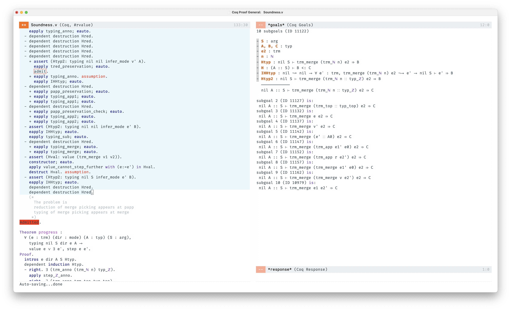

* No Vim bindings any more
* The design is based on [nano-emacs](https://github.com/rougier/nano-emacs)
* Some non-trivial code is taken from [purcell/.emacs.d](https://github.com/purcell/emacs.d)
* The only language support is Coq right now

